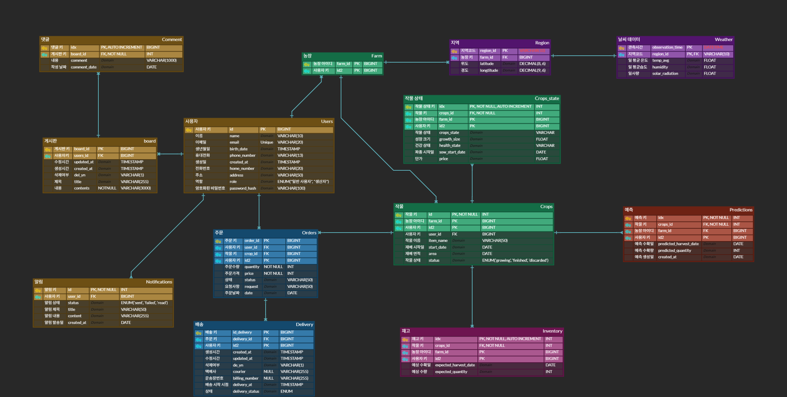
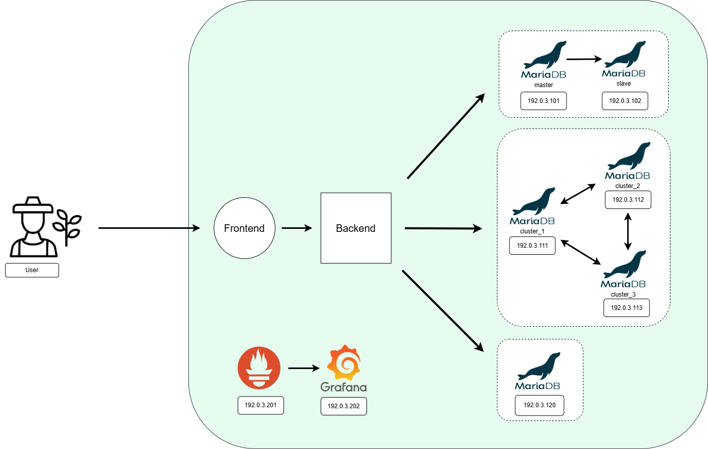

<br>


##  한 줄 소개

생육 데이터와 기상 정보를 활용해 농·수산물의 주문 가능 여부를 자동 판단하는 스마트 주문 관리 플랫폼

---

## 📋 프로젝트 개요

| 항목 | 내용 |
|------|------|
| **기간** | 2025.06 ~ 2025.09 |
| **인원** | 5명 |
| **내 역할** | DB 설계(ERD/요구사항), 프론트엔드 주문 UI · UI 품질 검토, 백엔드 주문 API 구현 · Swagger 문서화, GitHub 브랜치 관리 |
| **핵심 기술** | Spring Boot, Vue 3, MariaDB, Docker, Kubernetes, Jenkins |

---

## 🕵️ 팀원 소개

<div align="center">

|  |  |  |  |  |
| :-----------------------------------------------------------------------------------------: | :----------------------------------------------------------------------------------------: | :-----------------------------------------------------------------------------------------: | :----------------------------------------------------------------------------------------: | :-----------------------------------------------------------------------------------------: |
|                 🦊 **양승우**<br/>[@atimaby28](https://github.com/miyad927)                 |                🐻 **이시욱**<br/>[@David9733](https://github.com/David9733)                |                 🦎 **구창모**<br/>[@kucha240](https://github.com/kucha240)                  |                🐰 **유현경**<br/>[@gaangstar](https://github.com/gaangstar)                |                  🐱 **윤소민**<br/>[@somminn](https://github.com/somminn)                   |

</div>

---

## 🎯 프로젝트 목적

"자라는 만큼만 주문받는다."

농·수산물의 생육 상태와 생물 건강 데이터를 기반으로 주문 가능 여부를 자동 판단·관리하는 B2B 스마트 주문 플랫폼입니다.

- **기존 방식**: 재고 기반 판매
- **본 서비스**: 공공 데이터(기상정보, 생육 센서 등)와 실시간 생물 정보(성장률, 건강도)를 분석해 주문·배송 시점 예측 및 자동 제어
- **효과**: 생산자는 재고 과잉·무리한 주문 방지, 소비자는 신선한 상품과 정확한 일정 제공

---

## 🙋 내 기여

### 1단계 · DB 설계

- 역할별 요구사항 명세서 작성 및 ERD 설계
- DB 서버 6대 아키텍처 설계
  - Replication (Master-Slave): 단일 DB 장애 시 Failover 대응
  - Clustering: 실시간 기상 데이터 중단 방지
  - 연산 전용 DB 분리: 운영 DB 부하 격리

### 2단계 · Frontend

- Argon Dashboard 2 템플릿 선정 및 커스터마이징으로 UI 초기 구조 구축
- Figma 디자인 작업
- 기능별 시나리오 테스트 및 오류 검토
- 주문 관련 화면(주문 생성·조회·수정·완료) 구현

### 3단계 · Backend

- 주문 관련 CRUD API 구현 (OrderController, CartController 등)
- SpringDoc(Swagger) 기반 API 문서화 적용

### 4단계 · 협업 관리

- GitHub 브랜치 관리 및 PR/merge 검토로 충돌 예방 프로세스 수립

---

## 🧩 요구 사항 명세서 바로가기

  <a href="https://docs.google.com/spreadsheets/d/1XSZN87etTnIHmDfupnch9-_gnz6C2W93tIQPNkhwSUY/edit?gid=1400486362#gid=1400486362" target="_blank">
    🔗 요구사항 명세서 바로가기
  </a>

---

## 📐 ERD



---

## ✨ 주요 기능

-  생육·기상 데이터 기반 주문 가능 여부 판단
-  농장·작물 등록 및 재고 관리
-  장바구니·주문·결제 (Portone 연동)
-  생산량 예측 (기상 데이터 유사도 매칭)
-  카카오 OAuth2 로그인
-  WebSocket 채팅, 푸시 알림
-  판매량 조회, 대시보드

---

## 🛠️ 기술 스택

**Backend**
Spring Boot 3.5.4, Java 17, Spring Security, JWT 0.11.5, OAuth2(Kakao), QueryDSL 5.0.0, WebSocket, AWS S3, SpringDoc 2.8.4, PortOne SDK 0.19.2, Web Push 5.1.1

**Frontend**
Vue 3.4.19, Pinia 3.0.3, Vue Router 4.3.0, Axios 1.10.0, Chart.js 4.4.1, Bootstrap 5.3.3

**DB**
MariaDB 10.6.22, MySQL 8.0.42

**Infra**
Docker, Kubernetes, Jenkins, Kaniko, Ansible, Ingress

**모니터링**
JMeter, Prometheus, Grafana

**협업**
Git, GitHub, Figma, Discord


<div>
  
  
  
  
  
  
  
  
  
  
</div>

---

## 🗄️ DB 아키텍처



---

## 🏗️ CI/CD 아키텍처


---

## 🤔 기술 선택 이유

### Backend / Frontend

| 구분 | 선택 | 이유 |
|------|------|------|
| **Backend 프레임워크** | Spring Boot 3.5 | Spring Security·JPA·WebSocket 등 필요한 기능을 일관된 방식으로 통합할 수 있어 선택 |
| **인증** | JWT | Stateless 구조로 서버 세션 부담 없이 Kubernetes 다중 인스턴스 환경에서 인증 처리 가능 |
| **소셜 로그인** | Kakao OAuth2 | 별도 회원가입 없이 간편 로그인 제공, Spring Security OAuth2 Client로 연동 |
| **DB** | MariaDB | MySQL 호환 오픈소스, 팀 학습 경험 보유 |
| **ORM / 쿼리** | QueryDSL | 농장·작물 조건 검색 등 동적 쿼리가 필요한 부분에 타입 안전 쿼리 작성 |
| **결제** | PortOne | 국내 PG 통합 SDK, 서버 측 결제 금액 검증 API 제공 |
| **Frontend 프레임워크** | Vue 3 | Composition API로 컴포넌트 재사용성 향상, 팀원 학습 경험 고려 |
| **상태 관리** | Pinia | Vue 3 공식 권장 상태 관리 라이브러리, Vuex 대비 타입 추론과 코드량 간결 |
| **배포 전략 (프론트)** | Canary | UI 변경을 일부 사용자(20%)에게 먼저 적용해 검증 후 전면 배포 |
| **배포 전략 (백엔드)** | Blue-Green | 트래픽 한 번에 전환해 무중단 배포, 문제 시 즉시 롤백 가능 |

### Database

데이터베이스 서버를 총 6대로 구성하였습니다. 2대는 Replication, 3대는 Clustering, 나머지 1대는 연산 전용 서버로 운영합니다.

| 구분 | 선택 | 이유 |
|------|------|------|
| **Replication** | Master-Slave | 운영 서버의 단일 DB 장애 시 전체 서비스 중단을 막기 위해 데이터 복제(Data Replication)를 적용했습니다. Master 장애 시 Slave로 자동 전환(Failover)이 가능하도록 구성하여 서비스 가용성과 안정성을 최우선으로 하였습니다. |
| **Clustering** | Galera Cluster | 작물 상태·온도·습도·일사량 등 실시간 기상 데이터가 끊기면 자동화 시스템이 오작동할 수 있어, 클러스터링으로 장애를 대비했습니다. |
| **연산 전용 DB** | Separate DB | 운영 DB에 부하를 주지 않고 분석·집계 작업을 수행하기 위해 별도 DB를 분리했습니다. 시계열 데이터의 반복 집계 쿼리가 운영 서비스 성능에 영향을 주지 않도록 하였습니다. |

### CI/CD

Jenkins(프론트·백엔드 분리 빌드) + Kaniko(데몬 없는 이미지 빌드) + Ansible(서버 설정 자동화) + Ingress Controller(경로 기반 라우팅·배포 전략 지원) 조합으로 구성.

---

## 🔑 핵심 메서드 (주문 파트)

| 함수/메서드 | 위치 | 설명 |
|-------------|------|------|
| `createOrder` | OrderService | 장바구니 ID 목록으로 주문서 생성, 사용자 검증 및 총 가격 계산 |
| `orderConfirm` | OrderService | 주문 확정, 주문번호 생성 후 DB 저장 |
| `addCart` | CartService | 장바구니 담기, 기존 상품이면 수량·가격 갱신 |
| `allCarts` | CartService | 사용자별 장바구니 목록 조회 |
| `validation` | PaymentService | PortOne 결제 검증, 금액 대조 후 결제 내역 저장 |

---

## 🔧 트러블슈팅 / 개선 경험

- **Merge 충돌**: 팀원들이 중간중간 merge를 하지 않아, 나중에 한꺼번에 합칠 때 충돌이 자주 발생함. 이를 해결하기 위해 GitHub 정리 및 merge 확인을 담당하여 주기적인 merge를 유도함.

- **SQL 성능 개선 (선행 팀 프로젝트)**:
  팀 공동으로 JMeter를 활용해 DB에 직접 부하를 가하고, Prometheus·Grafana로 부하 양상을 시각적으로 관찰했습니다.
  관찰 결과를 바탕으로 쿼리 구조를 변경(JOIN → Subquery, 0.063s → 0.047s)하고 Index를 적용(actual time 2.57ms → 0.255ms)하여 응답 속도를 개선했으며,
  데이터 수가 적어 성능 개선 효과를 충분히 검증하기에는 한계가 있었으나, 측정 결과를 바탕으로 데이터 증가 시 추가 개선 가능성을 확인했습니다.

---

## 🚀 실행 및 테스트

### 로컬 실행

**Backend**
```bash
cd backend
./gradlew bootRun
```
필요 환경변수: `DB_URL`, `DB_USERNAME`, `DB_PASSWORD`, `AWS_ACCESS_KEY`, `KAKAO_CLIENT_ID` 등 (application.yml 참고)

**Frontend**
```bash
cd frontend
npm install
npm run serve
```

### CI/CD 배포 테스트

1. Jenkins에 `pipelineFrontend.yaml`, `pipelineBackend.yaml` 파이프라인 등록
2. GitHub WebHook 설정 (Push/Merge 시 트리거)
3. main 브랜치 Push 후 파이프라인 자동 실행 확인


